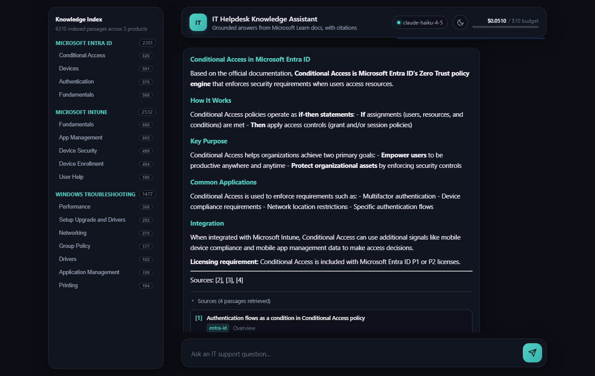

# IT Helpdesk Knowledge Assistant

A local-first Retrieval-Augmented Generation (RAG) system that answers IT
support questions grounded in official Microsoft documentation, with every
answer citing exactly which document it came from.

The code is intentionally verbose and commented throughout, explaining not
just what each step does but why it's built that way — meant to be read
and adapted, not just run as a black box.

```
Question -> embed -> similarity search (ChromaDB, local) -> top-K passages
         -> Claude (Haiku/Sonnet) -> grounded answer + citations
```



## Real-world use case

Tier-1 IT helpdesks and MSPs re-answer the same handful of questions
constantly — password/MFA issues, device enrollment, printer and driver
problems, registry edits. A tool like this sits in front of a support
queue and either answers the question directly (ticket deflection) or
gives a level-1 agent a cited, verifiable starting point instead of a
guess. The citation-first design matters here: an agent (or the assistant
itself) can click through to the source article and confirm the steps are
current before acting, rather than trusting an ungrounded LLM answer.

## Architecture & why these choices

| Component | Choice | Why |
|---|---|---|
| Embeddings | `BAAI/bge-base-en-v1.5` via `sentence-transformers` | Runs on CPU, no API cost, strong general-purpose retrieval quality. ~6,300 chunks embed in a few minutes on a CPU-only VM. |
| Vector store | ChromaDB (local, file-based) | Zero setup — no server, no cloud account, no Docker. Persists to `chroma_db/` on disk. |
| Generation | Claude API | `claude-haiku-4-5` by default (cheap, fast, plenty capable once retrieval has already found the right context); swap to `claude-sonnet-5` in `config.py` or via the `CLAUDE_MODEL` env var to compare quality. |
| Data source | Official Microsoft Learn docs, sparse-cloned from public GitHub repos | Clean Markdown straight from the source Microsoft publishes from — no HTML scraping, no rate limits, no guessing at page structure. |

### Why sparse git clone instead of scraping learn.microsoft.com

The Learn site is rendered from the same public Markdown files Microsoft
publishes to GitHub. Cloning just the folders we need (`--filter=blob:none
--sparse`) gets clean source text directly, with a verifiable citation URL
(the exact GitHub file we read) for every chunk — no HTML-parsing
brittleness and no ambiguity about where an answer came from.

### Chunking strategy

Microsoft Learn pages are split by Markdown heading first (a `##` section
is usually a self-contained sub-topic), then any section still longer than
**1200 characters** is split further with a **150-character overlap** using
a sliding window that prefers to break on a paragraph or sentence boundary.
1200 characters (~250-300 tokens) keeps each chunk focused enough for
precise retrieval while staying well inside the embedding model's context
window; the overlap avoids losing meaning right at a cut point (e.g. a
sentence that explains a setting immediately after the heading that names
it). Pure navigation sections ("Related articles", "See also") are dropped
before chunking — they're boilerplate link lists that would otherwise show
up as near-duplicate noise across hundreds of pages.

See `scripts/chunk_documents.py` for the full implementation and inline
reasoning.

### Grounding / anti-hallucination

The system prompt (in `generate.py`) instructs Claude to answer **only**
from the retrieved passages, to say plainly when they don't contain the
answer, and to never invent or reference a URL/KB number that isn't
explicitly present in the context. In testing, both failure modes were
confirmed to work as intended: an out-of-corpus question ("reset a user's
MFA method") correctly got "the passages don't contain this," and an
early version was caught inventing a plausible-looking but unverified
`docs.microsoft.com` link in prose — fixed by explicitly forbidding that
in the prompt.

## Data sources

- **Microsoft Learn documentation** — public, official docs sparse-cloned
  from `MicrosoftDocs/entra-docs`, `MicrosoftDocs/memdocs`, and
  `MicrosoftDocs/SupportArticles-docs` on GitHub (Azure AD/Entra ID,
  Intune, and Windows client troubleshooting/drivers/registry
  respectively). ~507 pages, ~6,300 chunks.
- No proprietary, customer, or company data of any kind is used anywhere
  in this project — everything is public Microsoft documentation.
- An IT support ticket dataset was considered as a second source but is
  out of scope for this version; the pipeline is structured so a ticket
  dataset (or any other document set) can be added later as its own
  source without changing the embedding, indexing, or generation code —
  see "Using your own documents" below.

## Setup

**Requirements:** Python 3.11 specifically. Newer versions (3.13/3.14) may
not yet have full wheel support across the ML libraries this project uses
(`torch`, `sentence-transformers`, `chromadb`); 3.11 is the safest choice
today. `git` on your PATH (used to sparse-clone the doc sources).

```powershell
py -3.11 -m venv venv
venv\Scripts\pip install -r requirements.txt
copy .env.example .env
# then edit .env and add your real ANTHROPIC_API_KEY
```

Get a key at https://console.anthropic.com/.

## Running the pipeline

Each step is a standalone, checkpointed script — run them in order the
first time you set up the project:

```powershell
venv\Scripts\python scripts\fetch_ms_docs.py      # ~1-2 min, downloads ~507 doc pages
venv\Scripts\python scripts\chunk_documents.py    # seconds, splits into ~6,300 chunks
venv\Scripts\python scripts\build_index.py        # ~10 min on CPU, embeds + indexes everything
venv\Scripts\python scripts\test_retrieval.py     # sanity-check retrieval, no API cost
```

Then ask questions, either from the terminal or in a browser:

```powershell
venv\Scripts\python ask.py       # interactive CLI
venv\Scripts\python webapp.py    # web UI at http://127.0.0.1:5000
```

Both are thin front-ends over the same `generate.py` retrieve-then-generate
pipeline — pick whichever fits your workflow. Every answer shows
the retrieved source passages (titles, products, links) and the real token
count / cost of that specific query, plus a running total across all runs
(logged to `logs/cost_log.jsonl`).

The web UI (`webapp.py`) is a small Flask app — a glassmorphism chat
interface (blurred, translucent panels over a soft gradient background)
with a light/dark toggle (persisted in `localStorage`, defaults to your OS
preference), rendered Markdown answers, an expandable "Sources" panel per
answer, and a live spend-vs-budget meter in the header. It's self-contained
(no external JS/CSS libraries, no CDN calls) and runs on Flask's built-in
dev server — fine for local single-user demoing, not hardened for public
deployment (see "Out of scope" below).

A **Knowledge Index sidebar** shows every product and topic actually in the
vector store (e.g. Windows Troubleshooting → Networking, Drivers, Group
Policy, ...) with live chunk counts per topic, computed once at startup
from the index itself — not hand-maintained, so it can't drift out of sync
with what's actually indexed. Clicking a topic asks a starter question
scoped to it. The `topic` field (one level more specific than `product`)
is derived from each doc's source folder in `scripts/chunk_documents.py`'s
`topic_for_doc()` — no re-fetching needed, since it's recoverable from data
already in the manifest.

## Cost tracking

Every Claude API call logs its actual `usage` (input/output tokens, priced
per `config.MODEL_PRICING_PER_MILLION_TOKENS`) to `logs/cost_log.jsonl`.
With Haiku, a typical query costs **$0.001-0.003** — building and testing
this entire project end-to-end cost well under a cent. `claude-sonnet-5` is
roughly 5x the per-token cost; useful for a side-by-side quality
comparison on a handful of queries, not for high-volume testing.

## Using your own documents

This is meant to be a reusable template, not a one-off:

1. Add a new script under `scripts/` that fetches your documents and
   writes them (plus a `manifest.json` with `id`/`title`/`product`/
   `source_url`) into a new folder under `data/raw/`.
2. Add a chunking function for your document shape (or reuse
   `chunk_documents.py`'s Markdown splitter if your docs are Markdown).
3. Run `scripts/build_index.py` — it reads `data/processed/chunks.jsonl`
   generically and doesn't care which source produced it.

`config.py` is the single place to adjust chunk sizes, the embedding
model, the Claude model, and retrieval settings.

## Out of scope (by design)

- GPU acceleration — this runs CPU-only end-to-end, deliberately.
- Cloud-hosted vector databases — ChromaDB is local-only here.
- Real company or proprietary ticketing system data — public Microsoft
  docs only.
- Production auth, multi-user support, or deployment infrastructure — this
  is a local, single-user reference implementation.

## Project structure

```
config.py             # all settings: models, paths, chunk sizes
embeddings.py          # embedding model wrapper (query vs. document handling)
vector_store.py         # ChromaDB connection wrapper
generate.py             # retrieval + Claude generation + citations
cost_logger.py          # per-call token/cost tracking
ask.py                  # interactive CLI entry point
webapp.py               # Flask web UI entry point
templates/index.html    # web UI page
static/style.css        # web UI styling
static/app.js           # web UI chat interaction (vanilla JS, no dependencies)
scripts/
  fetch_ms_docs.py       # sparse-clone + clean Microsoft Learn docs
  chunk_documents.py     # Markdown-aware chunking
  build_index.py         # embed chunks + write to ChromaDB
  test_retrieval.py       # manual retrieval sanity check (no LLM/API cost)
data/
  raw/ms_docs/            # cleaned source pages + manifest.json
  processed/chunks.jsonl  # chunked, ready-to-embed passages
chroma_db/               # persistent vector store (gitignored, rebuildable)
logs/cost_log.jsonl      # per-query token/cost log (gitignored)
```
